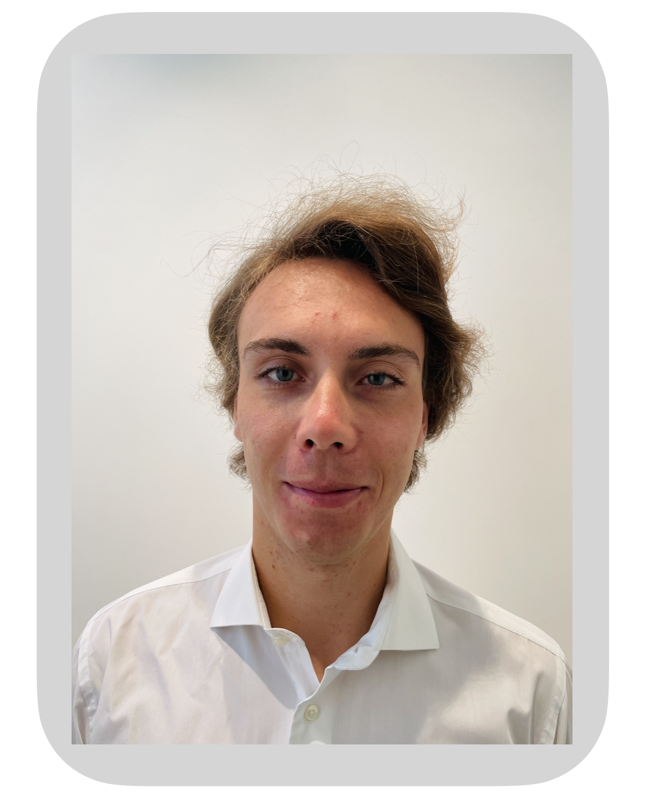

\

# About Me

\

 

__________________________

This is Leon. I am an avid ```R``` enthusiast and love to analyze and extract process flow data. Within this environment you can find the results of my publishable research as a ``` R Markdown ``` file. It is reflecting my motivation as a Business Analyst.

I hold both a Bachelor's and a Master's degree in Management & Technology from the Technical University of Munich (TUM), as well as a Bachelor's degree in Business Administration from the Cooperative State University Baden-Wuerttemberg, Germany (DHBW).

My work so far has mainly involved the analysis of process data in the food industry and time-series data in the renewable energy sector. 


